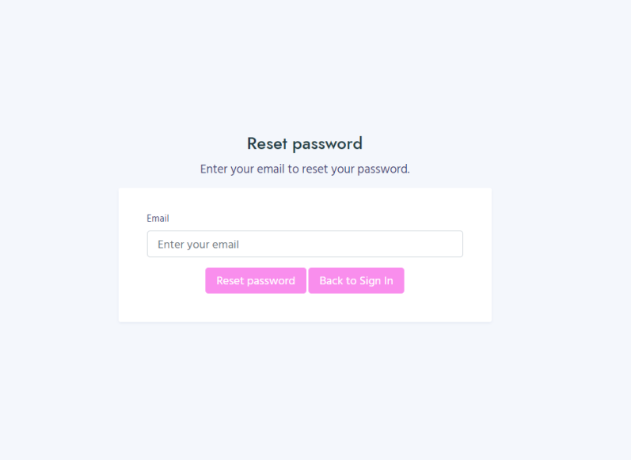
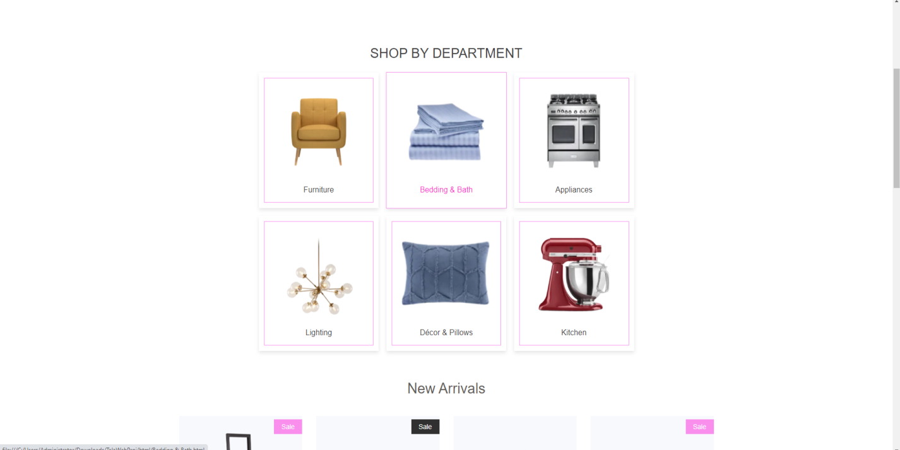
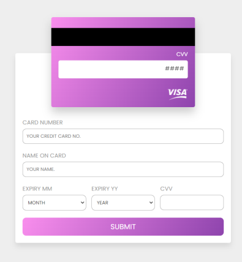

# Online-Home-Store
Web-based project which will let the end users from ordering a good quality items for their home such as furniture and other stuff.  
# Interfaces:
## Sign in Page:
This is the startup page which let the user enter his own account whether he/she a client or admin,  in case the user has an existing account in the website he will need to enter his Email and password to enter his account, and in case they don’t have an account in our website he will need to click on Sign up and start making an account.
In case the user forgot his own password then he need to click on forgot password which will take him to the forgot password page, and we make the pages in our websites responsive.  

## Sign up Page:
This page is for the new users who don’t have an account in our websites , they will be required to enter some personal information such as Email, username, address, and there password, the system will also recognize whether the user is already exist or no in our websites. 
 

## Forgot Password Page:
In this page the user will need to enter his email the system will check if the account(email) is exist in our database or not, if its exist then after clicking on the Reset Password, then it will be reset to specific password, and if we want to go back to the login page then we can click on the back button.

## Home Page:
The user will be able to reach this page after signing successfully in our website, otherwise the website won’t let them reach this page, this page will contains an interact list, buttons and others. The first thing the user will interact with is the list located in the top of the page, each label in it will take the user either to specific location in the page or to other pages in the website, it also contains logos for the user/admin account and the cart list, and also ability to log out.

The second thing the user will interact with is the shop categories, this part of the page will contains all the departments (categories) in our website such as Furniture, Bedroom, Kitchen and others. Each one of the shown departments has its own page which will contains all the products found in our database and include under the specified department.

Then user will notice a part which contains all the new products which have been arrived lately, and also the most unique products ( products that will attract the users), each one of the products (new arrivals, featured) will have an animation button appears whenever the user point to one of the products, this button will give a quick view on the product and its description, finally we should note that each one of these products is also found in the shop departments pages, and can see them there also.

## Department Page:
This page will appear depend on the department which the user has choose in the home page, in any page of the departments the list found in the top of the home page will found there also and the footer part of the home page, between them all the products that involve under the specified category will be shown with their information such as name, price and image for the product.
So in the furniture page the user will see all the products found in our database that involves under this department and each one of these product will have animated button as shown below which will view the product and more images, we should note that the pages are responsive also

## Product detail Page:
This page will contains the List and the Footer found in the home page, and the main part found in the body it will show the image of the specified product and its own price and description for the product. There is also ability to maximize the image of the product to see it clearly. If the user want to processed and buy the product then he should first add the product to the cart using the button (add to cart), and the system will give indication message that the product has been added successfully as shown:

## Payment Page:
In this page the user is going to enter his own visa card information such that he could proceed in the payment process, So that the value of the products found in the cart will deducted from the card. The user should enter the information such Name, VISA id and expired date, and the CVV. We should note that the card is interactive such that while the user enter the information it will be filled on the card on the specific location, and when enter the CVV it will be flipped.

## Administrator Page:
When the user sign in our website our system will recognize whether the user is a normal client or admin, if he is a client then the normal home page we mention earlier will appear for him, otherwise the admin page will appear. This page contain all the system information needed for the admin to keep track with our website, such as the customer, order, product information’s.

## Admin Products Page:
This page will make the admin able to add products to the system, such as he will be required to give all the necessary information about the product such name, price, description, image for the product, and which department this product involve in. after clicking on the add button the system will check for all the information given by the admin, if there any field empty the system won’t add the product and will indicate the admin.

## Admin Clients Page:
This page will show all the customers with their information such address, name, email, and his own credit card ID. We should mention that it will be responcive and contains the header list and footer found in the home page.

